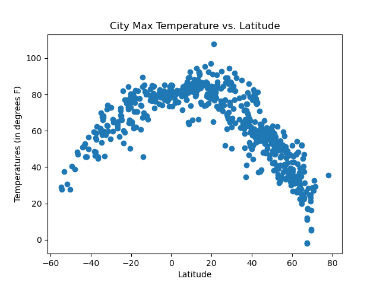
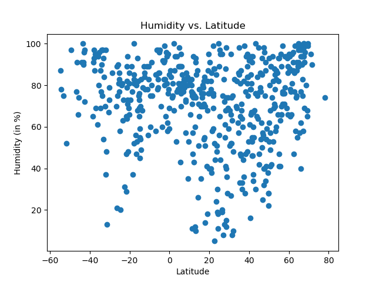
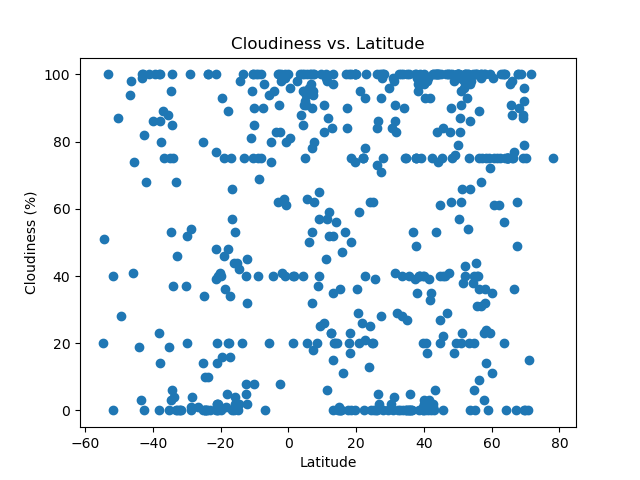
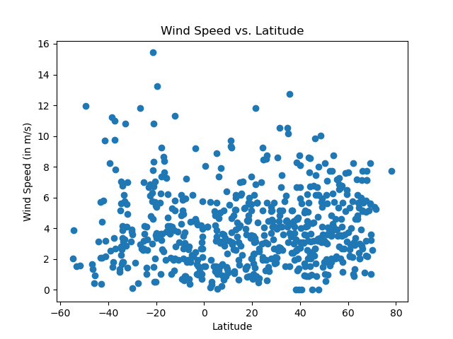

**WEATHERPY AND VACATIONPY CHALLENGE**

**(1) Project Overview and Purpose:**

This execise will provide two items for the user, (a) visualization of the weather for over 500 cities of varying distances from the equator [hereafter termed "WeatherPy'] and (b) information (city names; weather characteristics; etc.) for planning future vacations [hereafter termed "VacationPy"]. 

**(2) Dataset Description:**

Some data for the WeatherPy aspect was retrieved from OpenWeather [api.openweathermap.org/] via Application Programming Interface [API], resulting in a JavaScript Object Notation [JSON] after the API response was transformed. Other data was available in a .csv file named "cities.csv", filed in the **output_data** folder, which included information on location (city identifier; city name; and country); geographical coordinates (latitude and longitude); and weather information (maximum temperature; humidity; cloudiness; wind speeds; and date).

Some data for the VacationPy aspect was retrieved from Geoapify [api.geoapify.com/] via API, resulting in a JSON after the API response was transformed, and was augmented by information in the "cities.csv" file.

**(3) Data Cleaning and Preprocessing:**

The API responses were considered clean and transformed into JSONs. No cleaning was required for the .csv file.

The API responses were the result of a specific requests for information from each website, respectively and were visualized in DataFrames for an assessment of comprehensiveness.

**(4) Data Visualization Techniques:**

For WeatherPy, Scatter Plots (with and without Linear Regression) were generated.

For VacationPy, maps were generated.

**(5) Results and Analysis:**

For WeatherPy, the following plots were generated-

(a) Maximum Temperature vs. Latitude:

(b) Humidity vs. Latitude:

(c) Cloudiness vs. Latitude

(d) Wind Speed vs. Latitude

**(6) Ethical Considerations:**

(Discuss any ethical considerations taken into account during the project, such as data privacy, bias, or fairness)

**(7) Instructions for Interacting with the Project:**

(Provide clear instructions on how to interact with the visualizations, such as how to run the code or access the visualizations)

Citations:

(1) .copy(). (2023, April 2). Retrieved from https://www.codecademy.com/resources/docs/pandas/dataframe/copy/

(2) Xpert Learning Assistant:

    (a) question about requesting metrics units from https://openweathermap.org/api

    (b) question about how to define a function

    (c) question about changing map plot colors

    (d) questions about visualizing json response and diagnosing issues when no hotels were being identified for VacationPy exercise
