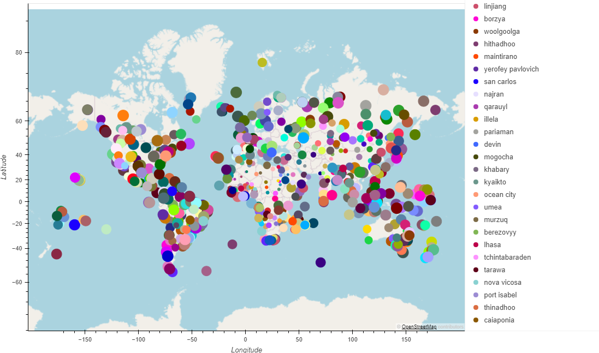
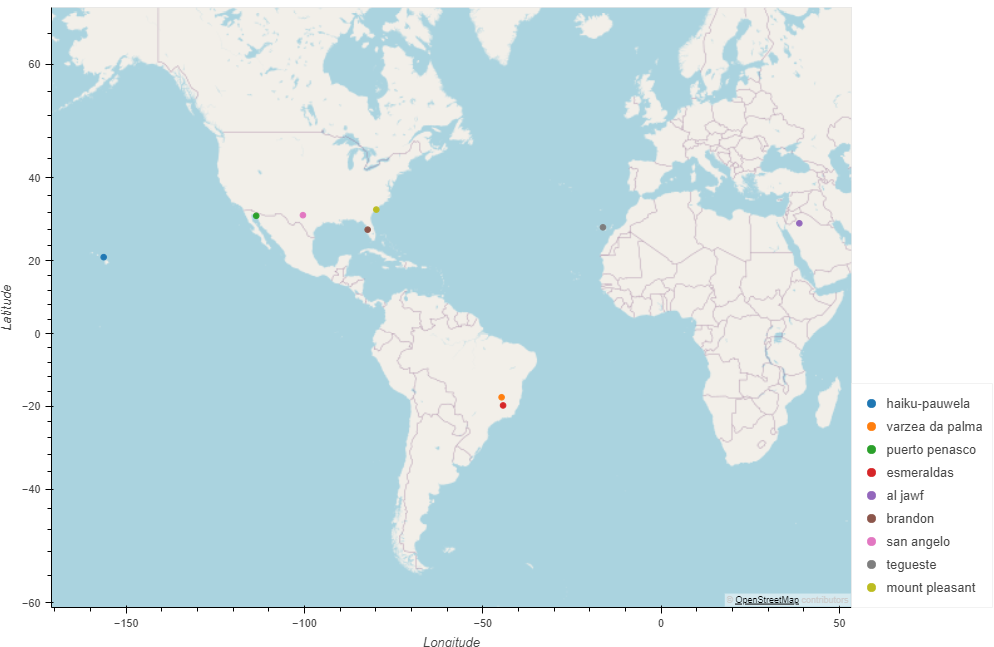

**WEATHERPY AND VACATIONPY CHALLENGE**

**(1) Project Overview and Purpose:**

This execise will provide two items for the user, (a) visualization of the weather for over 500 cities of varying distances from the equator [hereafter termed "WeatherPy'] and (b) information (city names; weather characteristics; etc.) for planning future vacations [hereafter termed "VacationPy"]. 

**(2) Dataset Description:**

Some data for the WeatherPy aspect was retrieved from OpenWeather [api.openweathermap.org/] via Application Programming Interface [API], resulting in a JavaScript Object Notation [JSON] after the API response was transformed. Other data was available in a .csv file named "cities.csv", filed in the **output_data** folder, which included information on location (city identifier; city name; and country); geographical coordinates (latitude and longitude); and weather information (maximum temperature; humidity; cloudiness; wind speeds; and date).

Some data for the VacationPy aspect was retrieved from Geoapify [api.geoapify.com/] via API, resulting in a JSON after the API response was transformed, and was augmented by information in the "cities.csv" file.

**(3) Data Cleaning and Preprocessing:**

The API responses were considered clean and transformed into JSONs. No cleaning was required for the .csv file.

The API responses were the result of a specific requests for information from each website, respectively and were visualized in DataFrames for an assessment of comprehensiveness.

**(4) Data Visualization Techniques:**

For WeatherPy, Scatter Plots (with and without Linear Regression) were generated.

For VacationPy, maps were generated.

**(5) Results and Analysis:**

(a) For WeatherPy, the following plots were generated-

(i) Maximum Temperature vs. Latitude:

(ii) Humidity vs. Latitude:

(iii) Cloudiness vs. Latitude:

(iv) Wind Speed vs. Latitude:

(v) Linear Regression for Temperature versus Latitude [Northern Hemisphere, followed by Southern Hemisphere]:

_For the relationship between Temperature and Latitude, both r-values indicate there is a strong association between Latitude and Maximum Temperature (per city), meaning as you approach the equator (Latitude = 0), the more likely it is that there is a higher Max Temperature per city. As you move northward from the south pole (increasing from -50 degrees to 0 degrees), temperatures would be higher near the equator. Likewise, moving southward from the north pole (80 degrees to 0 degrees), temperatures would be higher near the equator._

(vi) Linear Regression for Humidity versue Latitude [Northern Hemisphere, followed by Southern Hemisphere]:

_For the relationship between Humidity and Latitude, both r-values indicate weak to no association between Latitude and Humidity as you approach the equator (0 degrees) from either pole. Relatively flat line linear regression lines indicates no ability to predict humidity based on latitude._

(vii) Linear Regression for Cloudiness versue Latitude [Northern Hemisphere, followed by Southern Hemisphere]:

_For the relationship between Cloudiness and Latitude, both r-values indicate weak to no association between Latitude and Cloudiness as you approach the equator (0 degrees) from either pole. Clustering of points at 0% and 100% Cloudiness may indicate an association between Cloudiness and another factor, but Latitude is a poor predictor of Cloudiness per degree Latitude._

(viii) Linear Regression for Wind Speed versue Latitude [Northern Hemisphere, followed by Southern Hemisphere]:

_For the relationship between Wind Speed and Latitude, both r-values indicate weak to no association between Latitude and Wind Speed as you approach the equator (0 degrees) from either pole. As with Humidity above, relatively flat line linear regression lines indicates no ability to predict wind speed based on latitude._

(b) For VacationPy, the following maps were generated-

(i) Map of prospective vacation cities where marker size is determined by humidity (larger markers have higher humidity):

(ii) Map of prospective vacation cities where the temperature is between 21 and 27 degrees Celsius; no clouds; and the wind speed is less than 4.5 meters per second with hotel information:

**(6) Ethical Considerations:**

The data from API websites is generally readily available and contains no sensitive information. The .csv date could be collected in a similar format with significant effort, but also contains no sensitive information.

**(7) Instructions for Interacting with the Project:**

Python code is available in two files within the **WeatherPy** folder, namely "WeatherPy.ipynb" and "VacationPy.ipynb".

As noted above, "cities.csv", filed in the **output_data** folder.

Plots and maps are filed in in the **output_data** folder as .png files.

**(8) Citations:**

(a) .copy(). (2023, April 2). Retrieved from https://www.codecademy.com/resources/docs/pandas/dataframe/copy/

(b) Xpert Learning Assistant:

    (i) question about requesting metrics units from https://openweathermap.org/api

    (ii) question about how to define a function

    (iii) question about changing map plot colors

    (iv) questions about visualizing json response and diagnosing issues when no hotels were being identified for VacationPy exercise
